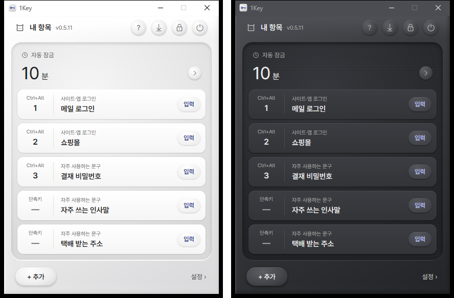
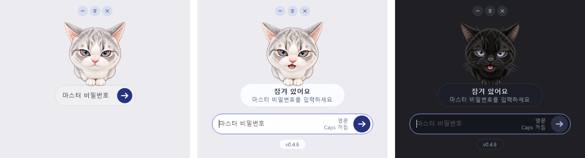
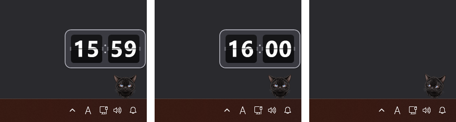
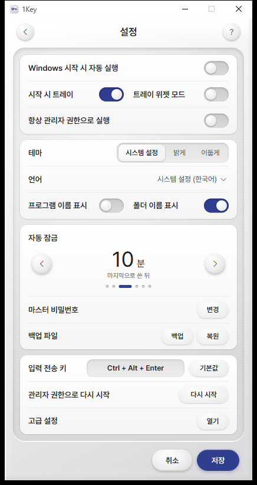
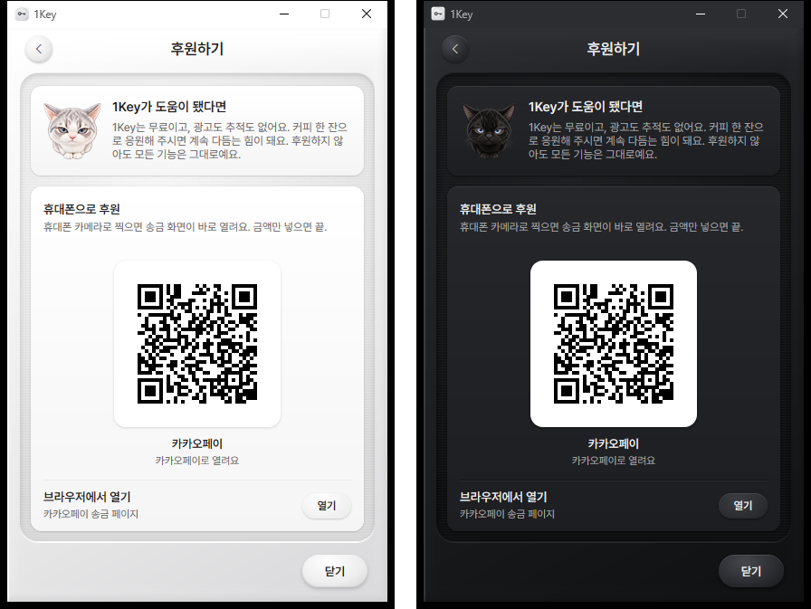

#  1Key

비밀번호·자주 쓰는 문장을 단축키 한 번으로 입력해 주는 Windows 11용 작은 프로그램입니다.
순수 Win32(C#, NativeAOT)로 만들어 런타임 설치 없이 exe 하나로 동작합니다.



## 주요 기능

### 단축키 한 번으로 입력

- 내용(비밀번호·문장)을 99개까지 저장하고 항목마다 단축키를 지정합니다.
- 단축키를 누르면 지금 커서가 있는 칸에 입력합니다(특수문자·대소문자 그대로). 입력 방식은 5가지(자동 / 스캔코드 / 유니코드 / 창 메시지 / 클립보드) 중에서 고를 수 있어, 잘 안 먹히는 창에서도 방식을 바꿔 대응합니다.
- 단축키를 외우지 않은 항목은 목록의 [입력]을 누르고, 화면 위에 뜬 작은 입력 칩으로 넣을 칸을 골라 넣습니다.
- 웹사이트·윈도우 프로그램의 입력칸에 항목을 연결하면 아이디와 비밀번호를 한 번에 채웁니다.

### 마스터 비밀번호로 잠금

모든 내용은 마스터 비밀번호(Argon2id)로 잠깁니다. 자동 잠금, 백업·복원을 지원합니다.
잠긴 동안에는 작은 잠금 위젯이 뜨고, 비밀번호를 넣으려고 칸을 누르면 고양이가 "냐옹" 합니다. 입력하는 동안에는 가끔 천천히 눈을 깜빡이거나 작게 메롱 하고, 마스터 비밀번호가 틀리면 귀를 내렸다 올립니다.



### 작업 표시줄 고양이 (선택)

설정에서 "트레이 위젯 모드"를 켜고 창을 트레이로 내리면, 작업 표시줄 오른쪽 위에 고양이가 앉아 마우스 쪽을 쳐다봅니다. 누르면 1Key 창이 열립니다.
매시 정각에는 화면 모서리에서 플립시계가 올라와 :59 → :00 으로 넘어가고, 고양이는 시계를 올려다봅니다.
고양이 색은 Windows 테마를 따라 밝은 회색 고양이 / 검은 고양이로 바뀝니다.
커서를 한동안 움직이지 않으면 고양이가 가끔(1~2분에 한 번) 앞발 인사·야옹·그루밍·기지개·벌러덩·벽에 기대기 같은 동작을 합니다(밝은 테마 — 검은 고양이 동작은 준비 중).



### 설정

설정은 한 화면에 모여 있고, 바꾼 내용은 [저장]을 눌러야 적용됩니다. Windows 시작 시 자동 실행, 테마(시스템 / 밝게 / 어둡게), 언어(한국어 · English · 简体中文 · 日本語 · Tiếng Việt), 자동 잠금, 입력 전송 키 등을 고릅니다.



### 후원

1Key 는 무료이고 광고도 추적도 없습니다. 도움이 됐다면 설정 맨 아래 **후원하기 › 열기** 에서 휴대폰으로 QR 을 찍어 카카오페이로 후원할 수 있습니다. 후원하지 않아도 모든 기능은 그대로이고, 이 화면은 직접 열 때만 보입니다(알림·팝업 없음). QR 은 빌드에 든 그림이라 화면을 열 때 네트워크를 쓰지 않습니다.



## 빌드

준비(한 번만): .NET 8 SDK, Visual Studio 2022 Build Tools("C++ 데스크톱 개발" + Windows 11 SDK). 설치 파일까지 만들려면 NSIS.

```
powershell -ExecutionPolicy Bypass -File build-aot.ps1
```

결과물: `build\<버전>\1Key.exe` 와 `build\<버전>\1Key-Setup-<버전>.exe`.

## 폴더

- `src/OneKey` — 프로그램 소스. 그림 자원은 `Assets/cat`, 글꼴은 `Fonts`(Pretendard, OFL 1.1 — `Fonts/OFL-Pretendard.txt`)
- `installer` — NSIS 설치 스크립트
- `tools/tests` — 창을 띄워 실제로 눌러 보는 시험 스크립트(시험용 설정 폴더만 씀: `ONEKEY_TEST=1`, `ONEKEY_CONFIG_DIR`, `ONEKEY_INSTANCE_SUFFIX`)
- `tools/i18n` — `src/OneKey/i18n/strings.tsv` 로 문구 코드를 만드는 생성기
- `tools/readme-shots.ps1` — 이 README 의 스크린샷을 예시 항목으로 다시 찍는 스크립트(`docs/images`)

## 알림

- 마스코트 고양이 그림은 AI(Codex)로 만든 그림입니다.
- 스크린샷의 항목과 값은 모두 예시입니다.
- 코드 서명이 없는 exe 라 처음 실행할 때 SmartScreen 경고가 나올 수 있습니다.

## 라이선스

[MIT](LICENSE). 함께 들어 있는 Pretendard 글꼴은 SIL Open Font License 1.1(`src/OneKey/Fonts/OFL-Pretendard.txt`)을 따릅니다.
